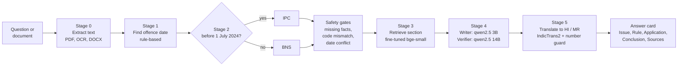
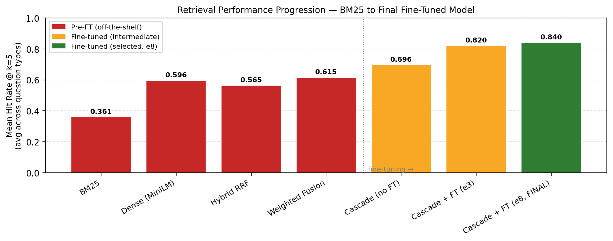
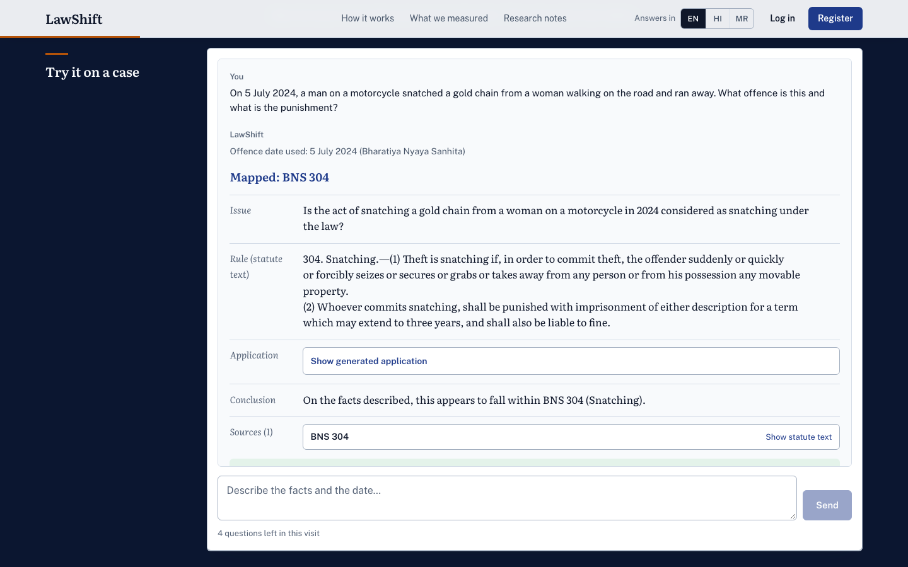

<div align="center">

# LawShift

### The day it happened decides which law applies.

A chat-first legal research tool for Indian criminal law. Give it an offence date and a description. It picks the **IPC** or the **BNS** from the date, finds the matching section, shows the statute text, and adds a short generated explanation.

[](https://law-shift.vercel.app)


**[Open the live site](https://law-shift.vercel.app)** · [Process log](PROCESS_LOG.md) · [Design notes](DESIGN.md) · [Product notes](PRODUCT.md)

</div>

> **About the hosted site.** [law-shift.vercel.app](https://law-shift.vercel.app) is the frontend only (landing page, accounts, case history, settings). The AI pipeline (retrieval, the writer and verifier models, translation) runs on the project machine, so chat answers on the hosted site show a short "AI service is not connected" message. To see the full system, run it locally (see [Run it locally](#run-it-locally)).

> **Not legal advice.** LawShift shows what a section says. Whether it applies to a set of facts is for a court to decide.

---

## Why this exists

On **1 July 2024** the Bharatiya Nyaya Sanhita (BNS) replaced the Indian Penal Code (IPC). An offence committed before that date is still tried under the IPC; one on or after it falls under the BNS. Section numbers changed, some sections were merged, split or dropped, and the old and new texts differ. Law students, junior advocates and journalists keep running into the same question: *which code applies, and what is the equivalent section?*

LawShift answers that in a single chat. The offence date decides the code, and the rest of the pipeline works inside that code.

## What it does

- **Date decides the law.** A hard date comparison in code (never a model guess) routes the offence to IPC (before 1 July 2024) or BNS (on or after).
- **Finds the section.** A fine-tuned retriever searches the statute corpus for the section that matches the described facts.
- **Shows the statute text as stored.** The Rule is copied from the section's main clause by code, not rewritten by a model.
- **Short generated explanation.** Issue and Application are written by a local model; the Conclusion is a fixed sentence written by code. A second, larger model checks the Rule.
- **Asks instead of guessing.** Missing date, missing facts, two close sections, a section from the wrong code, or dates on both sides of the cutoff all lead to a question, not an answer.
- **Reads documents.** Upload a typed PDF, a scanned PDF, a Word file or a photo of an FIR or complaint. The offence date is read from it (with OCR when needed).
- **IPC to BNS mapping browser.** Look up any IPC section and see its BNS equivalent (one-to-one, partial, merged or dropped).
- **Accounts and history.** Sign up, reset your password, and reopen any past answer from your history. Documents and history can be deleted with the account.
- **Three languages.** English, Hindi and Marathi. The interface strings in Hindi and Marathi are AI-drafted and need native review.

## How it works



| Stage | What it does | How |
|---|---|---|
| 0. Document | Extracts text from PDF, DOCX and images, fixes photo orientation | `pdfplumber`, Tesseract OCR, `python-docx` |
| 1. Date | Finds the offence date in the text | Rule-based, no language model |
| 2. Gate | Chooses IPC or BNS | Date comparison with 1 July 2024 |
| Safety gates | Missing facts, explicit section from the wrong code, date conflict across the cutoff, close-call sections ("None of these" is always offered) | Deterministic rules in `app/main.py` |
| 3. Retrieval | Finds the matching section inside the chosen code | Act-aware cascade with a fine-tuned `bge-small-en-v1.5` |
| 4. Generation | Writes Issue and Application, builds the fixed Conclusion, verifies the Rule | `qwen2.5:3b-instruct` (writer) and `qwen2.5:14b-instruct` (verifier) via Ollama |
| 5. Translation | Hindi and Marathi output, with a guard that rejects any translation that changes a number | IndicTrans2 |

## Results

Retrieval is evaluated on a held-out test split of 636 questions (seed 42) from the statute question-answer set.

| Measure | Result |
|---|---|
| Recall@5 (paper protocol) | **0.8412** (535 of 636) |
| MRR | 0.6547 |
| NDCG | 0.7016 |
| Recall@5 (production configuration) | 0.8381 (533 of 636) |
| Date extractor (Stage 1) | 44 of 44 on its test set |
| Regression suite | 12 PASS, 0 FAIL, 1 INFO |

The regression suite also covers the safety behaviours: nine diagnosis cases, fact-free queries, a 285-query false-block check (0 false blocks), code-mismatch (6 of 6), section lookup (7 of 7) and date-conflict (3 of 3) cases.

These numbers describe retrieval on this project's own test split and its own small hand-built test sets. They are not a claim about performance on arbitrary legal questions. See [`PROCESS_LOG.md`](PROCESS_LOG.md) for the full measurements, including approaches that did not help.

Fine-tuning is what moved the needle. Averaged over the question types, the hit rate at 5 rises from **0.361** (BM25) and **0.596** (off-the-shelf dense retrieval with MiniLM) to **0.840** for the final fine-tuned cascade:

<p align="center">
  
</p>

<!--
Screenshots (add these to docs/screenshots/ and uncomment):
<p align="center">
  
</p>
-->

## Datasets

| Dataset | Source | Size | Used for |
|---|---|---|---|
| GSMS-B statutes | see `PROCESS_LOG.md` §1 | 1,059 sections (BNSS 531, BNS 358, BSA 170) | Retrieval corpus |
| GSMS-B QA | see `PROCESS_LOG.md` §1 | 6,354 questions, six question types | Training and evaluating the retriever |
| IPC to BNS mapping | `nandhakumarg/IPC_and_BNS_transformation` | 562 usable rows | Mapping browser, IPC corpus |
| GovIntel | `aashnasharma/govintel-legal-dataset` | 12,859 records, 460 end-to-end cases | Evaluation |
| nyaya-eval-v0 | `NyayaLabs98/nyaya-eval-v0` | 185 filtered rows | External validation |

Training pairs use hard negatives (same-chapter sections plus near-misses from an earlier model). The statute text is shown as stored, including its digitisation slips. Check each source's licence before reusing the data.

## Tech stack

| Layer | Technology |
|---|---|
| Frontend | Next.js 15 (App Router), React 19, TypeScript, CSS Modules |
| Backend | FastAPI, Uvicorn |
| Retrieval | sentence-transformers, fine-tuned `bge-small-en-v1.5` |
| Generation | Ollama with `qwen2.5:3b-instruct` and `qwen2.5:14b-instruct` |
| Translation | IndicTrans2 (Hugging Face) |
| Documents | `pdfplumber`, Tesseract, `python-docx` |
| Auth and data | Supabase (email and password, row-level security, private document bucket) |
| Hosting | Vercel (frontend), local machine (AI backend) |

## Run it locally

You need Python 3.11, Node.js, [Ollama](https://ollama.com) (the native Apple Silicon build is about 20 times faster than an Intel build under Rosetta), Tesseract, and a Supabase project of your own.

```bash
# 1. Models for the writer and verifier
ollama serve                                  # in its own terminal tab
ollama pull qwen2.5:3b-instruct
ollama pull qwen2.5:14b-instruct

# 2. Backend (repo root)
python3.11 -m venv .venv && source .venv/bin/activate
pip install -r requirements-backend.txt       # plus the ML stack, see notes below
export SUPABASE_URL="https://<your-project>.supabase.co"   # required
export LAWSHIFT_ALLOWED_ORIGINS="http://localhost:3000"
python -m uvicorn app.main:app --host 127.0.0.1 --port 8000

# 3. Frontend
cd frontend
cp .env.local.example .env.local              # fill in your Supabase URL and publishable key
npm install
npm run dev                                   # http://localhost:3000
```

Notes:

- Use **`http://localhost:3000`**, not `127.0.0.1:3000`. CORS and Supabase redirect URLs accept `localhost` only.
- `SUPABASE_URL` is required. The backend refuses to start without it.
- `requirements-backend.txt` lists the backend extras. The ML stack (`torch`, `sentence-transformers`, `transformers==4.44.2`, `pdfplumber`, `pytesseract`) is installed separately, and a single pinned requirements file is not in the repo yet.
- The fine-tuned retriever checkpoint (`models/finetuned-bge-small-ipc-bns-e8`) is **not** in the repository because of its size. See `PROCESS_LOG.md` for how it was trained.
- Hindi and Marathi translation needs a Hugging Face login with access to IndicTrans2. Never put a token in a file.
- On the Apple GPU an answer takes about 6 to 23 seconds. The first question after a quiet period is slower while the models load.

## Tests

```bash
.venv/bin/python scripts/regression/run_all.py     # regression suite, no Ollama needed
.venv/bin/pytest tests/                            # hardening, routes, number guard
cd frontend && npx tsc --noEmit && npm run build   # typecheck and production build
```

## Deployment

The frontend is deployed on Vercel from the `main` branch with the Root Directory set to `frontend`. It needs two environment variables: `NEXT_PUBLIC_SUPABASE_URL` and `NEXT_PUBLIC_SUPABASE_ANON_KEY` (the publishable key). Set the AI backend address with `NEXT_PUBLIC_API_BASE` if the backend is reachable from the browser. Never use a service-role key in the frontend.

## Repository layout

```
app/          FastAPI backend: pipeline stages, safety gates, auth, limits
src/          Data preparation, fine-tuning, evaluation and generation scripts
frontend/     Next.js app (landing, workspace, history, mapping, rulings, settings)
scripts/      Regression suite and document-upload checks
tests/        Backend tests
data/         Cleaned statutes, mapping, splits, rulings index
paper_figures/  Figures used in the write-up
PROCESS_LOG.md  Numbered log of every experiment and decision
DESIGN.md       Interface design system
PRODUCT.md      Product notes
```

## Known limits

- Retrieval is imperfect (Recall@5 is 0.84, not 1.0). A wrong section is possible, and the answer always shows the statute text so it can be checked.
- The generated Application can occasionally disagree with the statute or the Conclusion. The Rule is always the statute text.
- Hindi and Marathi interface text is AI-drafted and unreviewed by a native speaker. Statute text itself is shown in English.
- Document upload reads English documents only.
- The curated "featured rulings" are hidden until each entry is verified.
- Conversation state (date locks, attachments) lives in memory and resets when the backend restarts.
- The app does not track amendments to a section over time. It switches between IPC and BNS by date.

## Acknowledgements

Built as a semester NLP project. Thanks to the creators of the datasets above, and to the open-source projects this builds on: Ollama, Qwen, BAAI bge, IndicTrans2, Next.js, FastAPI and Supabase.
